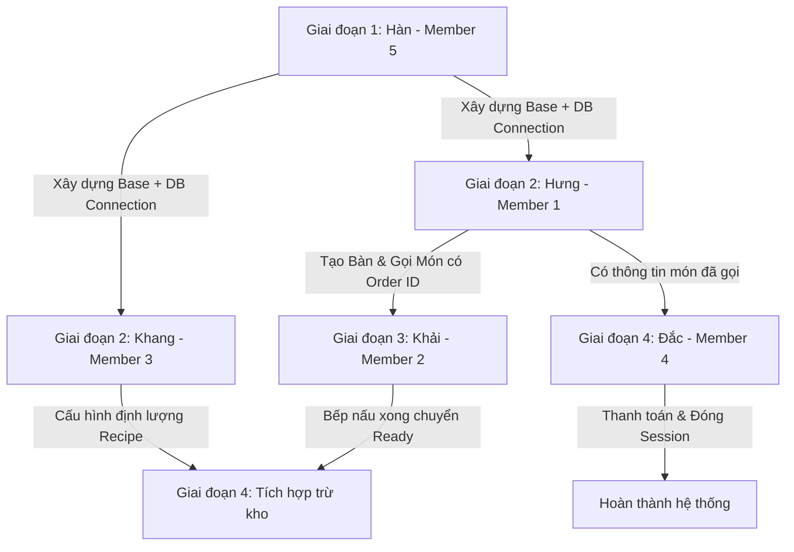

# PHÂN CHIA NHIỆM VỤ DỰ ÁN RESTAURANT POS

Tài liệu này định nghĩa vai trò, nhiệm vụ, thứ tự ưu tiên làm trước/sau, và quy tắc kiến trúc **WPF MVVM** để tránh xung đột mã nguồn (git conflicts).

---

## 👥 THÀNH VIÊN VÀ NHIỆM VỤ CHI TIẾT

### 1. 🧑🏫 MEMBER 5 — Hàn (ARCHITECTURE & CUSTOMER MANAGEMENT)
* **Bảng dữ liệu phụ trách**: `employees`, `customers`
* **Giao diện WPF (UI)**:
  * `LoginWindow.xaml` (Giao diện đăng nhập hệ thống).
  * `MainShellWindow.xaml` (Khung sườn chính chứa sidebar điều hướng).
  * `CustomerManagementView.xaml` (Màn hình thêm, sửa, xóa, tìm kiếm khách hàng bằng SĐT, quản lý hạng thành viên).
* **Lớp nghiệp vụ (Service & Repository)**:
  * `AuthService.cs` (Xác thực đăng nhập và bảo mật).
  * `CustomerService.cs` (Nghiệp vụ tích điểm, thăng hạng thành viên).
  * `CustomerRepository.cs` (Đọc ghi SQL bảng `customers`).
  * Lớp Base: `DatabaseHelper.cs` (Cung cấp kết nối SQL Server chung) và MVVM core (`ViewModelBase`, `RelayCommand`, `NavigationService`).
* **🧠 Logic chính**: Xác thực nhân viên -> Mở giao diện chính -> Phân quyền truy cập các Tab chức năng theo vai trò (Role). Quản lý khách hàng thân thiết.
* **⚠️ RULE**: Chỉ làm Core, Login, điều hướng và Quản lý khách hàng. KHÔNG can thiệp vào nghiệp vụ Bán hàng, Bếp hay Kho.

---

### 2. 🧑💻 MEMBER 1 — Hưng (POS Order & Table Module - CORE FRONTEND)
* **Bảng dữ liệu phụ trách**: `restaurant_tables`, `table_sessions`, `dining_sessions`, `orders`, `order_items`. (Chỉ đọc: `dishes`).
* **Giao diện WPF (UI)**:
  * `TableView.xaml` (Sơ đồ bàn ăn và trạng thái bàn trống/đang có khách/cần dọn dẹp).
  * `OrderView.xaml` (Menu chọn món ăn và danh mục menu).
  * `OrderDetailPopup.xaml` (Chi tiết các món đã gọi của bàn, sửa ghi chú, tăng giảm số lượng hoặc hủy món).
* **Lớp nghiệp vụ (Service & Repository)**:
  * `TableService.cs` & `OrderService.cs`.
  * `TableRepository.cs` & `OrderRepository.cs`.
* **🧠 Logic chính**: Chọn bàn -> Mở session bàn ăn -> Tạo order -> Thêm/xóa món ăn vào order_items.
* **⚠️ RULE**: KHÔNG tự cập nhật trạng thái nấu ăn của bếp. Trạng thái món gọi lên mặc định là `pending`.

---

### 3. 👨🍳 MEMBER 2 — Khải (KITCHEN DISPLAY SYSTEM)
* **Bảng dữ liệu phụ trách**: `order_items` (Chỉ cập nhật trạng thái `status` và `status_updated_at`). (Chỉ đọc: `orders`, `dishes`).
* **Giao diện WPF (UI)**:
  * `KitchenView.xaml` (Màn hình hiển thị danh sách các món cần chế biến dạng Kanban).
* **Lớp nghiệp vụ (Service & Repository)**:
  * `KitchenService.cs` & `OrderItemRepository.cs` (chỉ cập nhật status).
* **🧠 Logic chính**: Polling dữ liệu mỗi 5s để lấy món mới. Chuyển trạng thái nấu ăn: `pending` ➔ `cooking` ➔ `ready` (nấu xong) ➔ `served` (đã bê lên).
* **⚠️ RULE**: KHÔNG được tạo order mới, KHÔNG được sửa số lượng/ghi chú món, KHÔNG được đổi trạng thái bàn ăn.

---

### 4. 🥬 MEMBER 3 — Khang (INVENTORY & INGREDIENT SYSTEM)
* **Bảng dữ liệu phụ trách**: `ingredients`, `recipes`, `stock_receipts`.
* **Giao diện WPF (UI)**:
  * `IngredientView.xaml` (CRUD nguyên liệu, cảnh báo tồn kho thấp).
  * `StockReceiptView.xaml` (Màn hình nhập hàng vào kho).
  * `RecipeMappingView.xaml` (Ánh xạ công thức: 1 phần ăn tiêu tốn bao nhiêu nguyên liệu).
* **Lớp nghiệp vụ (Service & Repository)**:
  * `IngredientService.cs`, `StockService.cs`, `RecipeService.cs`.
  * `IngredientRepository.cs`, `StockRepository.cs`, `RecipeRepository.cs`.
* **🧠 Logic chính**: Quản lý kho nguyên liệu, nhập hàng. Tự động trừ tồn kho dựa trên công thức `recipes` khi món ăn được chuyển sang trạng thái đã hoàn thành (`ready` hoặc `served`).
* **⚠️ RULE**: KHÔNG đụng vào giao diện gọi món hay giao diện của bếp. Chỉ xử lý logic kho phía sau.

---

### 5. 💰 MEMBER 4 — Đắc (PAYMENT & REPORT SYSTEM)
* **Bảng/View dữ liệu phụ trách**: `invoices`, `payment_details`. (Đọc SQL Views: `vw_DailySalesSummary`, `vw_DailyBestSellingDishes`, `vw_DailyPaymentBreakdown`).
* **Giao diện WPF (UI)**:
  * `CheckoutView.xaml` (Giao diện chọn bàn ➔ Load hóa đơn tạm tính ➔ Thanh toán).
  * `ReportDashboardView.xaml` (Dashboard biểu đồ/bảng số liệu báo cáo doanh thu, top món bán chạy).
* **Lớp nghiệp vụ (Service & Repository)**:
  * `InvoiceService.cs`, `PaymentService.cs`, `ReportService.cs`.
  * `InvoiceRepository.cs`, `PaymentRepository.cs`, `ReportRepository.cs`.
* **🧠 Logic chính**: Tính tiền, chiết khấu, split payment (tiền mặt/quẹt thẻ/chuyển khoản), lưu hóa đơn, đóng session bàn ăn và cập nhật trạng thái bàn về `available` hoặc `needs_cleaning`.
* **⚠️ RULE**: KHÔNG chỉnh sửa số lượng/món trong `order_items`. Chỉ đọc để thanh toán.

---

## 📅 LỘ TRÌNH VÀ SỰ PHỤ THUỘC (WORKFLOW DEPENDENCIES)

Để dự án trơn tru, các thành viên cần thực hiện theo các giai đoạn sau:

### 🔹 GIAI ĐOẠN 1: Hàn xây dựng nền móng (MỌI NGƯỜI ĐỢI HÀN)
* **Nhiệm vụ ưu tiên cực cao**: Hàn cần code xong `DatabaseHelper.cs` (kết nối SQL Server thành công) và bộ khung MVVM Base (`ViewModelBase`, `RelayCommand`).
* **Lý do**: Đây là thư viện chung. Hưng, Khải, Khang, Đắc bắt buộc phải đợi Hàn đẩy file này lên Git thì mới có kết nối để gọi câu lệnh SQL và viết các class ViewModel thừa kế.

### 🔹 GIAI ĐOẠN 2: Waiter Gọi món (Hưng - M1) & Định lượng kho (Khang - M3)
* **Nhiệm vụ ưu tiên**: 
  * **Hưng (M1)** phải hoàn thành giao diện gọi món và lưu được thông tin `orders` và `order_items` vào CSDL với trạng thái `pending`.
  * **Khang (M3)** phải hoàn thành màn hình cấu hình công thức món ăn (`RecipeMappingView.xaml`) để liên kết đĩa ăn với nguyên liệu.
* **Lý do**: Nếu Hưng chưa làm xong màn gọi món, Khải (Bếp) sẽ không có dữ liệu `order_items` nào hiển thị trên màn hình bếp để nấu. Nếu Khang chưa cấu hình công thức, hệ thống sẽ không biết trừ bao nhiêu nguyên liệu khi món ăn hoàn thành.

### 🔹 GIAI ĐOẠN 3: Chế biến món ăn (Khải - M2) (ĐỢI HƯNG)
* **Nhiệm vụ**: Khải (M2) lấy dữ liệu món ăn do Hưng gọi xuống để hiển thị lên màn hình bếp và cập nhật trạng thái nấu ăn sang `cooking` rồi `ready`.
* **Lý do**: Khải phải đợi Hưng làm xong màn hình gọi món thì bếp mới có đồ để chế biến và đổi trạng thái.

### 🔹 GIAI ĐOẠN 4: Thanh toán (Đắc - M4) & Tự động trừ kho (Khang - M3 + Khải - M2)
* **Nhiệm vụ**: 
  * **Đắc (M4)** làm màn hình thanh toán hóa đơn. Đọc các món ăn đã hoàn thành (`ready` hoặc `served`) để tính tiền, thanh toán và in hóa đơn.
  * **Khang (M3)** viết trigger hoặc sự kiện tự động trừ kho nguyên liệu khi món ăn được chuyển thành `ready` (Bếp nấu xong) hoặc khi đơn hàng được thanh toán.
* **Lý do**: Đắc phải đợi Hưng gọi món và Khải làm xong thì mới có hóa đơn tổng để khách trả tiền. Khang phải đợi Khải cập nhật trạng thái món ăn nấu xong hoặc Đắc thanh toán để thực hiện trừ kho.

---

## 🛠 QUY TẮC PHÁT TRIỂN & TRÁNH XUNG ĐỘT (GIT CONFLICTS)

### 1. Quy tắc cấu trúc thư mục (Directory Structure)
Mọi người chỉ viết code giao diện, ViewModel, Service và Repository của mình trong đúng thư mục được chia sẵn để tránh xung đột file khi merge git:
* **Models/**: Chứa các Class Entity dùng chung cho cả nhóm. **Cấm tự ý sửa đổi** các file này nếu chưa có sự đồng ý của nhóm.
* **Data/**: Chứa `DatabaseHelper.cs` (Kết nối CSDL chung). Hàn quản lý.
* **Repositories/**: Chứa các repository truy vấn dữ liệu SQL. Thành viên phụ trách bảng nào thì viết repository tương ứng ở đây.
* **Services/**: Chứa logic nghiệp vụ. Các module giao tiếp với nhau **BẮT BUỘC** phải đi qua Service.
* **Views/ và ViewModels/**: Chia thư mục con theo thành viên:
  * Waiter ➔ `Views/Waiter/` và `ViewModels/Waiter/` (Hưng)
  * Kitchen ➔ `Views/Kitchen/` và `ViewModels/Kitchen/` (Khải)
  * Inventory ➔ `Views/Inventory/` và `ViewModels/Inventory/` (Khang)
  * Payment/Report ➔ `Views/Billing/` và `ViewModels/Billing/` (Đắc)
  * Core/Auth/Customers ➔ `Views/Core/` và `ViewModels/Core/` (Hàn)

### 2. Quy tắc đặt tên (Naming Conventions) - CỰC KỲ QUAN TRỌNG
Tất cả thành viên bắt buộc phải tuân theo quy tắc đặt tên sau đây để code sạch và dễ đọc:
* **Class & Interface**: Sử dụng `PascalCase`. Interface bắt đầu bằng chữ `I` (ví dụ: `IOrderService`, `OrderService`, `IEmployeeRepository`, `EmployeeRepository`).
* **Views (Giao diện XAML)**: Sử dụng `PascalCase` và có hậu tố rõ ràng:
  * Nếu là màn hình con (UserControl): Có hậu tố `View` (ví dụ: `TableView.xaml`, `KitchenView.xaml`).
  * Nếu là cửa sổ độc lập (Window): Có hậu tố `Window` (ví dụ: `LoginWindow.xaml`, `MainShellWindow.xaml`).
  * Nếu là hộp thoại hiển thị lên (Popup/Dialog): Có hậu tố `Popup` hoặc `Dialog` (ví dụ: `OrderDetailPopup.xaml`).
* **ViewModels**: Sử dụng `PascalCase`, phải khớp với tên View và bắt buộc có hậu tố `ViewModel` (ví dụ: `TableViewModel.cs`, `LoginViewModel.cs`, `BillingViewModel.cs`).
* **Services**: Sử dụng `PascalCase` và có hậu tố `Service` (ví dụ: `TableService.cs`, `IngredientService.cs`).
* **Repositories**: Sử dụng `PascalCase` và có hậu tố `Repository` (ví dụ: `OrderRepository.cs`, `IngredientRepository.cs`).
* **Biến private/protected (trong class)**: Sử dụng `camelCase` có dấu gạch dưới phía trước (ví dụ: `_connectionString`, `_currentUser`, `_employeeRepository`).
* **Biến public / Properties / Methods**: Sử dụng `PascalCase` (ví dụ: `CurrentEmployee`, `GetEmployeeById()`, `IsActive`).

### 3. Quy tắc kiến trúc MVVM
* ❌ **KHÔNG** viết code truy vấn SQL trực tiếp trong các file ViewModel hoặc View code-behind (ví dụ: `TableView.xaml.cs`).
* ❌ **KHÔNG** tương tác trực tiếp với các control UI (như gán text, ẩn hiện control trực tiếp bằng code-behind) từ ViewModel. Thay vào đó sử dụng `Data Binding` và `ICommand`.
* ✔️ Mọi truy vấn cơ sở dữ liệu phải tuân theo đúng luồng:
  `View` ➔ `ViewModel` ➔ `Service` ➔ `Repository` ➔ `DatabaseHelper (SQL Server)`

### 4. Quy tắc làm việc với Git
* ✔️ Trước khi viết code hoặc đầu buổi làm việc, bắt buộc phải `git pull` để nhận các cập nhật mới nhất từ nhóm.
* ✔️ **Quy tắc đặt tên nhánh (Branch Naming)**: Khi làm tính năng mới, tạo nhánh riêng từ `main` theo mẫu: `feature/ten_thanh_vien-ten_tinh_nang` (ví dụ: `feature/hung-goi_mon`, `feature/khai-man_hinh_bep`). Tuyệt đối không code trực tiếp trên nhánh `main`.
* ✔️ **Quy tắc gửi Pull Request (PR)**: Sau khi hoàn thành code trên nhánh riêng và đẩy lên GitHub, tạo Pull Request để gửi yêu cầu gộp code vào `main`. Trước khi gửi PR, phải đảm bảo:
  1. Ứng dụng biên dịch thành công (build success), không bị lỗi cú pháp.
  2. Đã đặt tên theo đúng Quy tắc đặt tên (Naming Conventions).
  3. Ghi chú rõ các file SQL hoặc cập nhật cấu trúc bảng mới (nếu có).
* ✔️ Chỉ commit những file code thuộc phạm vi phụ trách của mình. Tránh commit đè lên file của người khác.
* ✔️ Không commit các file tạm thời, file build (`bin/`, `obj/`, `.vs/`). (Đã được chặn tự động bởi file `.gitignore`).

---

## ⚠️ LƯU Ý QUAN TRỌNG KHI SETUP MÁY CỤC BỘ (TRÁNH LỖI KẾT NỐI CSDL)

Để ứng dụng chạy được trên máy của từng thành viên sau khi pull code về, các thành viên **bắt buộc** phải thực hiện 2 bước sau:

### 1. Khởi tạo Cơ Sở Dữ Liệu SQL Server cục bộ
* Ở thư mục gốc dự án có thư mục [Database/](file:///d:/SU26_semeter5/POS/RestaurantPOS/Database) chứa file script [database_schema.sql](file:///d:/SU26_semeter5/POS/RestaurantPOS/Database/database_schema.sql).
* Mở **SQL Server Management Studio (SSMS)** trên máy bạn, mở file SQL này lên và nhấn **Execute** để tạo cơ sở dữ liệu `RestaurantPOS` cùng 14 bảng mẫu và dữ liệu kiểm thử.

### 2. Cấu hình chuỗi kết nối trong `App.config`
* Mở file [App.config](file:///d:/SU26_semeter5/POS/RestaurantPOS/RestaurantPOS/App.config) trong project.
* Thay đổi thuộc tính `Server=localhost` thành **tên SQL Server Instance trên máy của bạn** (Ví dụ: `Server=.\SQLEXPRESS` hoặc `Server=DESKTOP-XXXX\SQLEXPRESS`).
* **Lưu ý**: Chỉ sửa file này để chạy cục bộ trên máy mình, **HẠN CHẾ** commit đè chuỗi kết nối cá nhân lên nhánh `main` chung.
